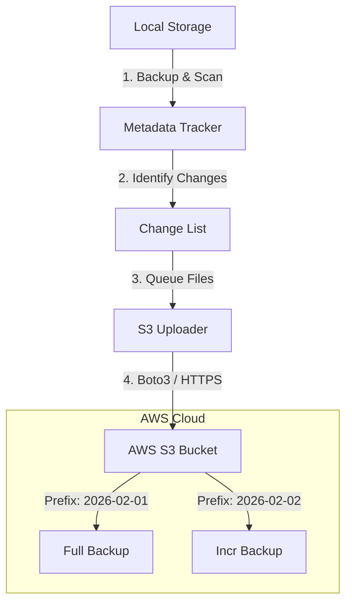

# ☁️ Cloud Backup Architecture: AWS S3 Integration

**Role:** Cloud Backup Architect  
**Provider:** AWS S3 (Simple Storage Service)  
**Strategy:** Incremental Delta-Push

---

## 1. Architecture Diagram



## 2. Storage Structure

We will use a partitioned keyspace for efficiency:

```text
s3://<bucket-name>/
├── <device-id>/                  # Unique ID for this Linux machine
│   ├── current/                  # (Optional) Mirror of latest state
│   ├── history/
│   │   ├── 2026-02-01_10-00-00/  # Backup Job 1
│   │   │   ├── full_backup_file1.doc
│   │   │   └── metadata.json     # Critical: Describes the state
│   │   └── 2026-02-02_10-00-00/  # Backup Job 2
│   │       ├── only_changed_file.doc
│   │       └── metadata.json     # Links to previous versions
```

## 3. Workflow Implementation

### Phase 1: Authentication
- Use standard AWS credentials file (`~/.aws/credentials`) or Environment variables.
- We assume the user has configured an IAM User with `s3:PutObject` and `s3:ListBucket` permissions.

### Phase 2: Selection (The "Smart" Part)
We do **not** blindly upload the backup folder.
- If we uploaded the local incremental folder (which has hard links), S3 would store duplicate copies of unchanged data.
- **Solution:** We iterate through the `new` and `modified` lists from our `BackupJob` result.
- **Result:** Zero duplication. Only changed bytes fly over the wire.

### Phase 3: Transfer
- **Multipart Uploads:** Automatically split files >8MB into chunks.
- **Concurrency:** Use `Threading` (via `boto3.s3.transfer.TransferConfig`) to upload 10-20 files in parallel.
- **Encryption:** Enable `ServerSideEncryption='AES256'` standard.

### Phase 4: Resilience
- **Retry Logic:** If a chunk fails, retry with exponential backoff (1s, 2s, 4s...).
- **Checksums:** Calculate Local MD5/SHA and verify ETag header from S3 response.

---

## 4. Python Implementation Logic

### Requirements
```bash
pip install boto3
```

### Configuration Class
```python
@dataclass
class CloudConfig:
    enabled: bool = False
    provider: str = "aws"
    bucket_name: str = ""
    region: str = "us-east-1"
    storage_class: str = "STANDARD_IA" # Infrequent Access checks cheaper
    path_prefix: str = "backups"
```

### The S3 Uploader Class (Prototype)

See `s3_uploader.py` for the complete implementation code.
